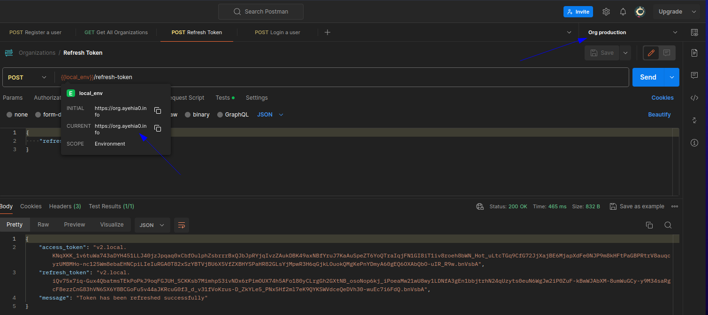

# Organization API

This repository houses a Golang-based API application designed for managing organizations. The application includes features such as token management, CRUD operations for organizations, user invitations, and integration with MongoDB using Docker.

## Setup

To run the application locally, you need to have docker installed on your machine and make (if you don't have make check the Makefile for `compose-build`)
- `make compose-build` then `make compose-up`

The application uses `Dockerfile` in production while it uses `Dockerfile.dev` in development. as in development I have hot reload enabled! which is missing in the production.

## Documentation

Check out the postman documentations [here](https://documenter.getpostman.com/view/20745767/2s9YyzdJDh)

## Notes

- I tried my best to follow the given structure, even though I have some takes on it like we can merge handlers and controllers into single `service`.
- The application is very simple and it's not meant for production use.
- I will refactor the code but as I don't have time for this now, all I care about is finishing the project before time (later on I will create branches satisfying the new changes)
- As you have noticed I have mongo-express to see the database

- I highly recommend using postman to try the API, make sure to use the `Org production` Env.

- I am saving the session in the database and also in redis memeory, I know that we can drop mongodb session saving but for consistancy and compatibility I decided to keep everything
- The application sturcture and code is very scalable, you can see there are many unused things but I kept for the furture!
- Revoking the refresh token doesn't expire the current access token, so current access token will keep working!
- The production server is very limited: 1gb ram and 1 CPU core, so keep that in mind!
- The way I use and store configs really annoys me, I prefer using `.env` to also be able to using as vars in `docker-compose.yaml`
- Talking about the configs, I know I left the secrets exposed on propose (I never do that in production or even in any project) coz the propose of the application is to be delivered in 4 days!

## Project Structure

- **cmd/**: Contains the main application file.
  - **main.go**: The entry point of the application.

- **pkg/**: Core logic of the application divided into different packages.
  - **api/**: API handling components.
    - **handlers/**: API route handlers.
    - **middleware/**: Middleware functions.
    - **routes/**: Route definitions.
  - **controllers/**: Business logic for each route.
  - **database/**: Database-related code.
    - **mongodb/**
      - **models/**: Data models.
      - **repository/**: Database operations.
  - **utils/**: Utility functions.
  - **app.go**: Application initialization and setup.

- **docker/**: Docker-related files.
  - **Dockerfile**: Instructions for building the application image.

- **docker-compose.yaml**: Configuration for Docker Compose.

- **config/**: Configuration files for the application.
  - **app-config.yaml**: General application settings.
  - **database-config.yaml**: Database connection details.

- **tests/**: Directory for tests.
  - **e2e/**: End-to-End tests.
  - **unit/**: Unit tests.

- **.gitignore**: Specifies files and directories to be ignored by Git.

## Todo
- [X] Add production branch
- [X] Refactor code
- [ ] Speed up production build process it takes like 120s to build!
- [ ] More refactoring :D
- [ ] Centeralize the configs in the docker-compose with the ones in `config/` + remove the secrets from production
- [ ] Add tests
